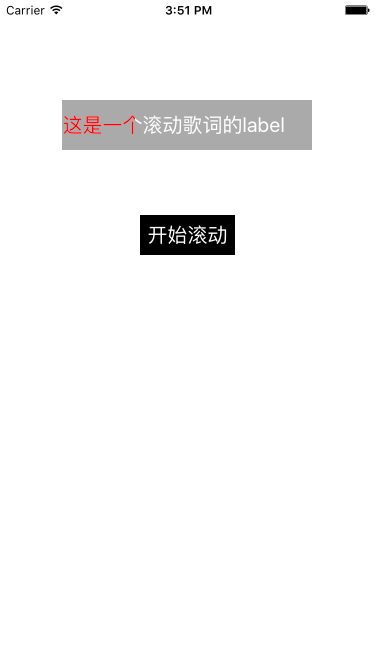

# ZSProgressLabel
 这是一个歌词滚动的Label，支持自动滚动，支持手动滑动
 
 
 
 使用方法：
 
 ```
 self.progressLabel.text = @"这是一个滚动歌词的label";
    self.progressLabel.backgroundTextColor = [UIColor whiteColor];
    self.progressLabel.foregroundTextColor = [UIColor redColor];
    self.progressLabel.font = [UIFont systemFontOfSize:20];
    
    //设置控制视图宽度
    //self.progressLabel.showWidth = self.progressLabel.frame.size.width/ 2.0;
    //self.progressLabel.disProgress = 0.5;
    
    //定时器时间
    //self.progressLabel.timeInterval = 0.1;
    
    //开启自动滚动
    self.progressLabel.isAutoScroll = YES;
    
    
    //开启拖动手势
    self.progressLabel.isPanGesture = YES;
    
    //拖动回调 拖动开始时关闭定时器， 拖动结束时(开始按钮为选中状态)开启定时器，否则不处理
    __weak typeof(self) weakself  = self;
    self.progressLabel.panGestureScrollHandler = ^(NSInteger pointX, CGFloat disProgerss){
        
        //开启定时器滚动的方法,与自动滚动方法不冲突
        
        // 1: 根据button.selected做判断
        pointX != 0 ? [weakself.progressLabel stopTimer] : weakself.startButton.selected ?  [weakself.progressLabel startTimer] : nil ;
        
        // 2: 根据 isRolling 做判断;
        
        //        if (pointX != 0) {
        //            if (weakself.progressLabel.isRolling) {
        //                [weakself.progressLabel stopTimer];
        //            }
        //        } else {
        //            if (!weakself.progressLabel.isRolling) {
        //                [weakself.progressLabel startTimer];
        //            }
        //        }
        
    };

 
 ```
 
 ```
 
 - (IBAction)buttonClick:(UIButton *)button {
    button.selected = !button.selected;
    
     button.selected ? [self.progressLabel startTimer] : [self.progressLabel stopTimer];
}
 ```